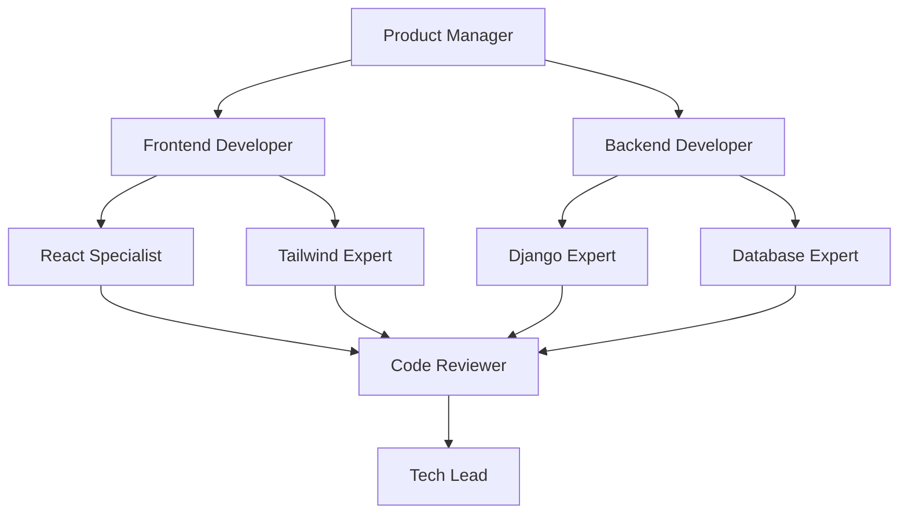
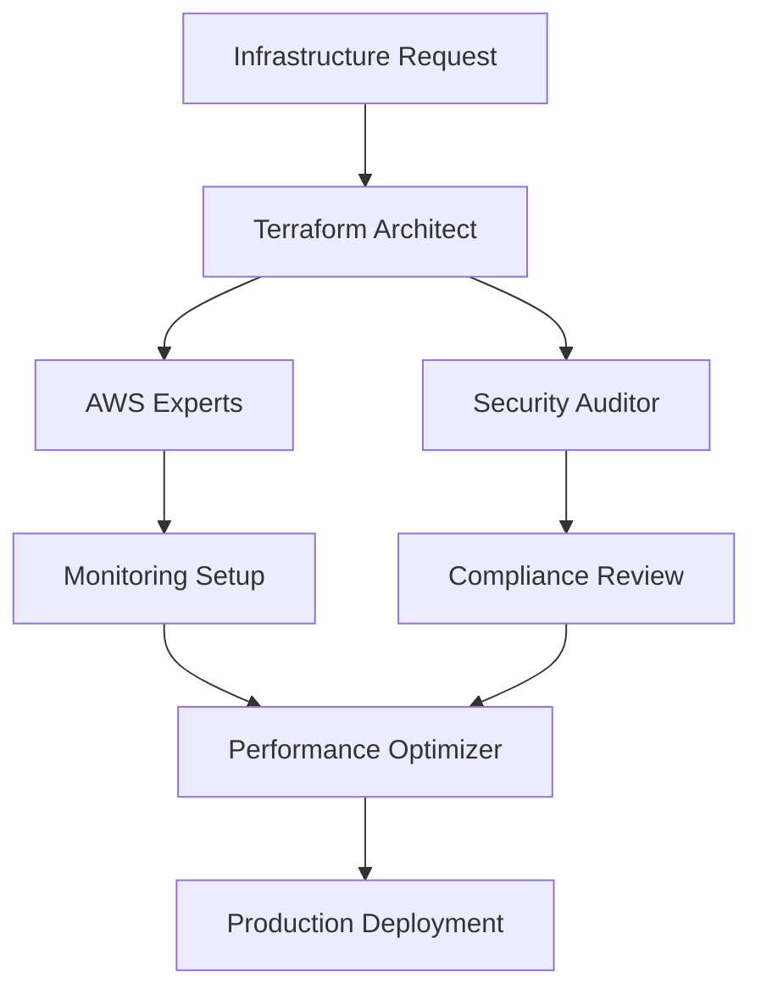

# Inter-Agent Delegation Patterns & Communication Protocols

## Overview

This document defines standardized patterns for agent delegation, handoff protocols, and communication between specialists in our agent ecosystem. These patterns ensure seamless workflow coordination and maximize collective agent effectiveness.

## Core Delegation Principles

### 1. Recognition-Based Triggering

Agents should recognize when tasks require expertise outside their domain through:

- **Keyword Detection**: Technology-specific terms, frameworks, tools
- **Complexity Indicators**: Advanced patterns requiring specialized knowledge
- **Scope Boundaries**: Tasks crossing domain boundaries
- **Quality Requirements**: Performance, security, accessibility needs

### 2. Context-Preserving Handoffs

When delegating, agents must provide:

- **Current State**: What has been accomplished
- **Specific Requirements**: What the target agent needs to deliver
- **Integration Context**: How the work fits into the larger system
- **Quality Standards**: Performance, security, accessibility requirements

### 3. Bidirectional Communication

Delegation should enable:

- **Clean Handoffs**: Clear transition of responsibility
- **Context Sharing**: Relevant project details and constraints
- **Result Integration**: Seamless incorporation of delegated work
- **Feedback Loops**: Learning from delegation outcomes

## Standard Handoff Message Format

### Basic Structure

```
## [DOMAIN] Implementation [STATUS]

### [Completed/Delivered/Ready]
- [List of deliverables with clear descriptions]
- [Key features or capabilities provided]
- [Performance/security/accessibility considerations]

### Integration Points
- [How this connects to existing systems]
- [Dependencies or prerequisites]
- [Configuration or setup requirements]

### Next Steps Available
- [Target Agent]: [Specific capability needed and why]
- [Another Agent]: [Alternative or complementary work]

### Files [Created/Modified]
- [Absolute file paths with brief descriptions]
- [Configuration changes made]
- [Documentation updates]

### Additional Context
- [Project-specific considerations]
- [Performance metrics or constraints]
- [Security requirements addressed]
```

### Example Handoff Messages

#### Frontend to Backend Delegation

```
## Frontend Implementation Complete

### Components Delivered
- User authentication UI with form validation
- Dashboard layout with responsive navigation
- Data visualization components for analytics
- Real-time notification system (frontend only)

### Integration Points
- Authentication: Expects JWT tokens from /api/auth endpoints
- Data Fetching: Components ready for REST API integration
- WebSocket: Real-time components need WebSocket connection
- File Upload: Profile component needs file upload endpoint

### Next Steps Available
- Backend Developer: Need API endpoints for user auth, dashboard data, file uploads
- Security Auditor: Review authentication flow and input validation

### Files Created
- /src/components/auth/LoginForm.tsx - Authentication UI
- /src/components/dashboard/Dashboard.tsx - Main dashboard layout
- /src/hooks/useAuth.ts - Authentication state management
- /src/types/api.ts - TypeScript interfaces for expected API responses

### Additional Context
- Using React Query for data fetching
- Components are fully responsive and accessible
- Dark mode support implemented
- Unit tests included for all components
```

#### Backend to Frontend Delegation

```
## API Implementation Complete

### Endpoints Delivered
- POST /api/auth/login - User authentication with JWT
- GET /api/dashboard/stats - Dashboard analytics data
- POST /api/files/upload - File upload with validation
- WebSocket /ws/notifications - Real-time notifications

### Integration Points
- Authentication: JWT tokens in Authorization header
- Rate Limiting: 100 requests/minute per user
- CORS: Configured for frontend domain
- Error Handling: Consistent error response format

### Next Steps Available
- Frontend Developer: API ready for integration, see documentation
- Infrastructure Expert: Need deployment configuration for production

### Files Created
- /api/routes/auth.js - Authentication endpoints
- /api/routes/dashboard.js - Dashboard data endpoints
- /api/middleware/auth.js - JWT validation middleware
- /docs/api-spec.yaml - OpenAPI specification

### Additional Context
- Database migrations included
- Input validation with Joi schemas
- Comprehensive error logging
- Performance optimized with Redis caching
```

## Agent-Specific Delegation Patterns

### Frontend Development Agents

#### React Component Architect

**Delegates To:**

- **Next.js Expert**: When SSR, routing, or Next.js-specific features needed
- **State Manager**: When complex state management patterns required
- **Backend Developer**: When API endpoints needed
- **Tailwind Expert**: When advanced styling or design system needed

**Receives From:**

- **Backend Developer**: API contracts and authentication requirements
- **Designer**: Design specifications and component requirements
- **Product Manager**: Feature requirements and user stories

#### SolidJS Specialist

**Delegates To:**

- **Tailwind Expert**: Advanced styling and responsive design
- **Backend Developer**: API integration and real-time features
- **Performance Optimizer**: Bundle optimization and performance tuning
- **Test Engineer**: Advanced testing strategies

**Receives From:**

- **Frontend Developer**: Component architecture decisions
- **Backend Developer**: API contracts and data flow requirements

#### Vue Component Architect

**Delegates To:**

- **Nuxt Expert**: For SSR and meta-framework features
- **State Manager**: For Pinia/Vuex complex patterns
- **Backend Developer**: For API integration
- **Tailwind Expert**: For styling and design systems

### Backend Development Agents

#### Django Backend Expert

**Delegates To:**

- **Django ORM Expert**: Complex database relationships
- **Django API Developer**: REST API and GraphQL implementation
- **Security Auditor**: Authentication and authorization review
- **Performance Optimizer**: Database optimization

**Receives From:**

- **Frontend Developer**: API requirements and data structures
- **Database Expert**: Schema design and migration strategies

#### Rails Backend Expert

**Delegates To:**

- **Rails ActiveRecord Expert**: Complex ORM patterns
- **Rails API Developer**: API design and implementation
- **Security Auditor**: Security best practices review
- **Performance Optimizer**: Database and application optimization

### Infrastructure & DevOps Agents

#### Terraform Architect

**Delegates To:**

- **AWS S3 Expert**: Storage configuration
- **EKS Expert**: Kubernetes cluster setup
- **Security Auditor**: Infrastructure security review
- **Monitoring Expert**: Observability setup

**Receives From:**

- **Backend Developer**: Infrastructure requirements
- **Security Requirements**: Compliance and security needs

#### AWS Service Experts

**Delegates To:**

- **Security Auditor**: Service security configuration
- **Monitoring Expert**: Service monitoring setup
- **Cost Optimizer**: Resource optimization

**Receives From:**

- **Infrastructure Architect**: Service integration requirements
- **Application Developer**: Application-specific needs

### Quality & Review Agents

#### Code Reviewer

**Delegates To:**

- **Security Auditor**: Security-specific review
- **Performance Optimizer**: Performance optimization
- **Documentation Specialist**: Documentation improvements

**Receives From:**

- **All Development Agents**: Code review requests

#### Security Auditor

**Delegates To:**

- **Penetration Tester**: Security testing
- **Compliance Expert**: Regulatory compliance
- **Infrastructure Security**: Infrastructure hardening

**Receives From:**

- **All Agents**: Security review requests

## Communication Protocols

### Escalation Patterns

#### When Complexity Exceeds Agent Scope

1. **Immediate Delegation**: Hand off to appropriate specialist
2. **Context Preservation**: Provide complete context and requirements
3. **Integration Planning**: Ensure smooth reintegration of work

#### When Multiple Agents Needed

1. **Orchestration Request**: Request tech lead or conductor agent
2. **Parallel Work**: Coordinate simultaneous work streams
3. **Integration Points**: Define clear interfaces between work streams

#### When Requirements Change

1. **Impact Assessment**: Evaluate impact on current work
2. **Stakeholder Communication**: Inform affected agents
3. **Replanning**: Adjust delegation and coordination as needed

### Quality Gates

#### Before Delegation

- [ ] Clear understanding of requirements
- [ ] Appropriate target agent identified
- [ ] Context and constraints documented
- [ ] Success criteria defined

#### During Handoff

- [ ] Complete status communicated
- [ ] All relevant files and documentation provided
- [ ] Integration requirements specified
- [ ] Next steps clearly defined

#### After Completion

- [ ] Work integrated successfully
- [ ] Quality standards met
- [ ] Documentation updated
- [ ] Lessons learned captured

## Advanced Delegation Scenarios

### Multi-Agent Coordination

#### Full-Stack Feature Development



#### Infrastructure Setup



### Cross-Domain Integration

#### API Development Workflow

1. **Frontend Developer**: Defines data requirements and interface needs
2. **API Architect**: Designs API structure and contracts
3. **Backend Developer**: Implements API endpoints
4. **Security Auditor**: Reviews security implementation
5. **Performance Optimizer**: Optimizes for scale
6. **Frontend Developer**: Integrates with completed API

#### Design System Implementation

1. **Designer**: Provides design specifications
2. **Tailwind Expert**: Creates utility classes and component styles
3. **React Specialist**: Implements reusable components
4. **Documentation Specialist**: Creates usage documentation
5. **Test Engineer**: Creates component tests
6. **All Frontend Agents**: Adopt and use design system

## Best Practices

### For Delegating Agents

1. **Be Specific**: Clearly articulate what you need
2. **Provide Context**: Share relevant project information
3. **Define Success**: Specify acceptance criteria
4. **Maintain Connection**: Stay available for questions
5. **Integrate Thoughtfully**: Review and integrate delegated work

### For Receiving Agents

1. **Confirm Understanding**: Clarify requirements before starting
2. **Communicate Progress**: Provide updates on complex work
3. **Document Decisions**: Explain architectural choices
4. **Test Thoroughly**: Ensure quality before handback
5. **Provide Context**: Explain how to use/integrate your work

### For System Efficiency

1. **Avoid Over-Delegation**: Don't delegate unnecessarily
2. **Batch Related Work**: Group related tasks for efficiency
3. **Plan Integration**: Consider how pieces fit together
4. **Monitor Quality**: Ensure delegation improves outcomes
5. **Learn and Adapt**: Improve delegation patterns over time

## Troubleshooting Common Issues

### Unclear Requirements

- **Problem**: Target agent asks for clarification
- **Solution**: Provide more specific requirements and context
- **Prevention**: Use detailed handoff message format

### Integration Conflicts

- **Problem**: Delegated work doesn't integrate well
- **Solution**: Review integration requirements and resolve conflicts
- **Prevention**: Specify integration points clearly upfront

### Quality Mismatches

- **Problem**: Delegated work doesn't meet standards
- **Solution**: Provide feedback and request improvements
- **Prevention**: Specify quality requirements in delegation

### Over-Delegation

- **Problem**: Too many handoffs slow down progress
- **Solution**: Consolidate work and reduce delegation layers
- **Prevention**: Delegate only when expertise gap exists

---

These delegation patterns enable our agent system to tackle complex, multi-domain challenges efficiently while maintaining high quality and clear communication throughout the development process.
