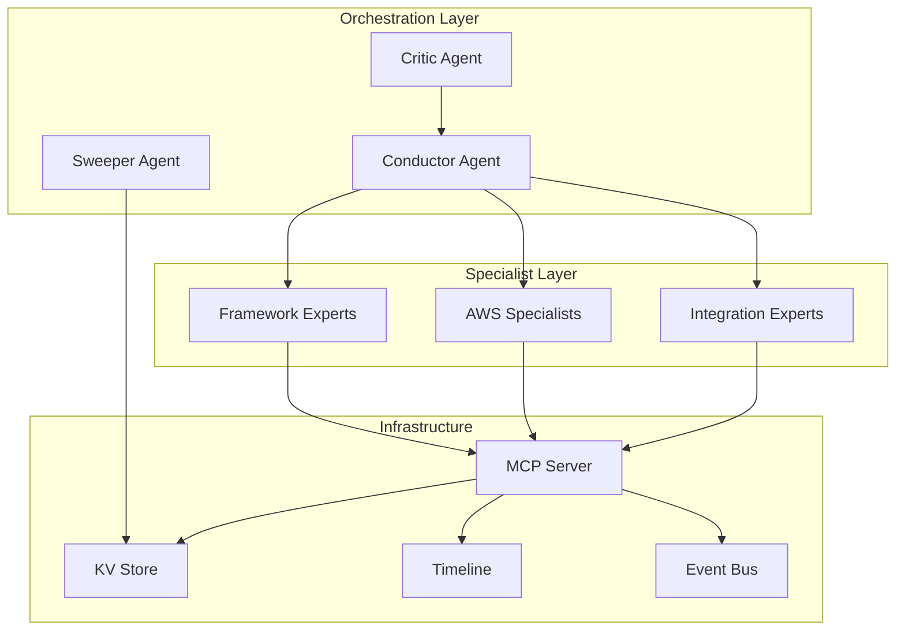

# Agent System Documentation

The AWS AI Agent Bus includes a sophisticated agent orchestration system with specialized agents for different domains and tasks.

## Core Agents

### [Conductor Agent](conductor.md)
Goal-driven planner and task delegator that orchestrates complex multi-step operations.

- **Role**: Strategic planning and delegation
- **Capabilities**: Task decomposition, resource allocation, progress monitoring
- **Lane**: `read_only` for safety during planning phase

### [Critic Agent](critic.md) 
Safety and verification agent that reviews and validates agent actions before execution.

- **Role**: Quality assurance and risk management
- **Capabilities**: Code review, security analysis, compliance checking
- **Lane**: `dry_run` for safe validation without side effects

## Specialized Agents

### Framework Experts
- **Django**: Backend development, ORM, API design
- **Laravel**: PHP backend development, Eloquent ORM
- **Rails**: Ruby on Rails development, ActiveRecord
- **React**: Frontend development, state management
- **Vue/Nuxt**: Vue.js development, SSR applications

### AWS Service Specialists
- **S3**: Storage management and optimization
- **DynamoDB**: NoSQL database operations
- **Lambda**: Serverless function development
- **EKS**: Kubernetes cluster management
- **IAM**: Security and access management
- **EventBridge**: Event-driven architecture
- **CloudWatch**: Monitoring and observability

### Integration Experts
- **Stripe**: Payment processing integration
- **GitHub**: Repository and workflow management
- **Slack**: Team communication and notifications
- **Vercel**: Frontend deployment and hosting
- **Supabase**: Backend-as-a-Service integration

## Agent Architecture



## Lane System

Agents operate in different "lanes" for safety and isolation:

- **`read_only`**: Safe operations, no side effects
- **`dry_run`**: Validation and testing without actual execution  
- **`execute`**: Full execution with real side effects

## Memory System

- **KV Store**: Agent state and configuration
- **Timeline**: Event tracking and audit trail
- **Vector Embeddings**: Contextual memory for decision making

## Configuration

Agent configurations are stored in `.claude/agents/` with standardized formats:

```yaml
name: "agent-name"
description: "Agent capabilities"
lane: "read_only|dry_run|execute"
capabilities:
  - "specific capability 1"
  - "specific capability 2"
tools:
  - "tool1"
  - "tool2"
```

## Token Economy

The agent system includes a sophisticated token economy for resource management and performance optimization. See [Token Economy Documentation](README.token-economy.md) for details.

## Development Guidelines

1. **Safety First**: All agents must validate inputs and handle errors gracefully
2. **Lane Compliance**: Respect lane restrictions to prevent unintended side effects
3. **Event Driven**: Use EventBridge for inter-agent communication
4. **Stateless**: Minimize agent state, use external storage
5. **Monitoring**: All operations should be observable and auditable

---

*For detailed agent specifications, see the individual agent documentation files.*