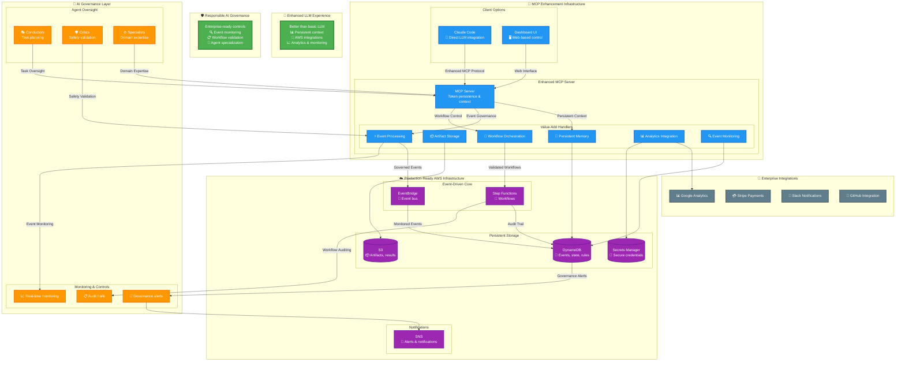

# AWS AI Agent Bus - Architecture Documentation

> **📄 Primary Diagram**: See [architecture-diagram.pdf](architecture-diagram.pdf) for the main visual architecture

This document provides detailed explanations of the components shown in the primary architecture diagram.

## Why This Infrastructure Matters

### 🚀 Enhanced LLM Experience
**Beyond basic LLM interactions** - This infrastructure transforms standard LLM usage by adding:
- **Persistent Context**: Never lose conversation history or learned patterns
- **AWS Integrations**: Direct access to production systems and data
- **Analytics & Monitoring**: Real-time insights into LLM usage and performance
- **Multiple Interfaces**: Choose between Claude Code integration or web dashboard

### 🛡️ Responsible AI Governance
**Enterprise-ready AI controls** for production deployments:
- **Event Monitoring**: Track every AI action with full audit trails
- **Workflow Validation**: Ensure AI operations follow business rules
- **Agent Specialization**: Dedicated experts for different domains with safety controls
- **Real-time Alerts**: Immediate notifications for policy violations or errors

## Architecture Components

### 🔌 MCP Enhancement Infrastructure
**Making MCP better than basic LLM chat:**
- **Claude Code Client**: Enhanced LLM integration with AWS capabilities
- **Dashboard UI**: Web-based monitoring and control interface
- **Enhanced MCP Server**: Adds persistence, context, and enterprise features
- **Value-Add Handlers**: Memory, storage, events, workflows, analytics, monitoring

### 🎯 AI Governance Layer
**Responsible AI workflow management:**
- **Agent Oversight**: Conductors plan, Critics validate, Specialists execute
- **Monitoring & Controls**: Real-time monitoring, audit trails, governance alerts
- **Safety Validation**: Every operation validated before execution
- **Task Planning**: Structured approach to complex AI workflows

### ☁️ Production-Ready AWS Infrastructure
**Enterprise-grade foundation:**
- **Event-Driven Core**: EventBridge + Step Functions for reliable orchestration
- **Persistent Storage**: DynamoDB for state, S3 for artifacts, Secrets Manager for credentials
- **Notifications**: SNS for real-time alerts and governance notifications
- **Scalability**: Auto-scaling, multi-tenant, cost-optimized architecture

### 🔗 Enterprise Integrations
**Connect AI to your business systems:**
- **Analytics**: Google Analytics for usage insights
- **Payments**: Stripe for billing and payments
- **Communication**: Slack for team notifications
- **Development**: GitHub for code management
- **Extensible**: Framework for adding new integrations

## Key Value Propositions

1. **Better than Basic LLM**: Persistent memory, AWS integrations, analytics
2. **Responsible AI Governance**: Event monitoring, workflow validation, audit trails
3. **Enterprise Ready**: Production AWS infrastructure with proper security
4. **Developer Friendly**: Both Claude Code and web interfaces supported
5. **Cost Optimized**: Tiered workspace model scaling from $10/month to enterprise
6. **Extensible**: Framework for adding new agents, integrations, and capabilities