# AWS AI Agent Bus Documentation

Welcome to the AWS AI Agent Bus documentation! This project provides a comprehensive infrastructure and toolset for building AI-powered agent systems on AWS.

## 🚀 Quick Start

- [**Setup Guide**](mcp-server/setup.md) - Get started with MCP Server setup
- [**Claude Integration**](CLAUDE.md) - Instructions for Claude Code integration
- [**Infrastructure Guide**](infra/README.md) - Terraform infrastructure overview

## 📚 Core Components

### 🤖 AI Features

AI-powered workflow generation, persistent chat, and intelligent assistance.

- [**AI Features Overview**](ai-features/) - Complete AI capabilities documentation
- [**Bedrock Setup Guide**](ai-features/bedrock-setup-guide.md) - AWS Bedrock configuration
- [**Chat System**](ai-features/CHAT_SYSTEM_COMPLETE.md) - Architecture and features
- [**Deployment Guide**](ai-features/DEPLOYMENT_BEDROCK_CHAT.md) - Production deployment

**Key Capabilities:**

- Context-aware workflow generation (knows your integrations)
- Persistent chat history (30-day retention in DynamoDB)
- Plan Mode & Edit Mode for different use cases
- Smart integration suggestions
- Real-time event-driven canvas updates

### 🔧 MCP Server

The Model Context Protocol server provides AI assistants with AWS service access.

- [**Rust MCP Server**](../mcp-rust/README.md) - High-performance Rust implementation
- [**Tool Catalog**](../mcp-rust/TOOLS.md) - Available MCP tools
- [**API Reference**](mcp-server/api.md) - Complete API documentation
- [**Google Analytics Setup**](mcp-server/google-analytics-setup.md) - Analytics integration

### 🏗️ Infrastructure

Terraform modules for scalable AWS deployment organized by workspaces.

- [**Infrastructure Overview**](infrastructure/) - AWS resources and IAM
- [**Bedrock IAM**](infrastructure/BEDROCK_IAM.md) - Permissions for AI features
- **Workspaces**: [Small](../infra/workspaces/small/) | [Medium](../infra/workspaces/medium/) | [Large](../infra/workspaces/large/)
- **Terraform Modules**: [DynamoDB](../infra/modules/dynamodb/) | [S3](../infra/modules/s3/) | [EventBridge](../infra/modules/eventbridge/)

### 🎭 Agent System

Sophisticated agent orchestration with conductors, critics, and specialists.

- [**Agent Definitions**](../.claude/agents/) - All agent configurations
- [**Mentor Agent**](../.claude/agents/mentor.md) - Documentation teacher
- [**Conductor Agent**](../.claude/agents/conductor.md) - Goal-driven planner
- [**Framework Experts**](../.claude/agents/) - Django, Rails, React, Vue, Terraform specialists

## 🛠️ Development

### Core Commands

```bash
# MCP Server development
cd mcp-server
npm install
npm test                    # Run full test suite (100% pass rate)
npm start                   # Start MCP server

# Infrastructure deployment  
export WS=small/kv_store && export ENV=dev
npm run tf:apply           # Deploy infrastructure

# Google Analytics reports
npm run setup:ga-credentials     # Interactive setup
npm run report:users-by-country  # Live GA report
```

### Testing & Validation

```bash
# Run comprehensive test suite
npm test                   # MCP server tests
npm run tf:validate       # Infrastructure validation
act                       # GitHub Actions locally
```

## 📋 Architecture

- [**Architecture Diagram (PDF)**](architecture-diagram.pdf) - Primary system architecture diagram
- [**Detailed Architecture Documentation**](architecture-diagram.md) - Comprehensive component descriptions

```mermaid
graph TB
    subgraph "🚀 Enhanced LLM Experience"
        ENHANCE[Better than basic LLM<br/>📊 Persistent context<br/>🔗 AWS integrations<br/>📈 Analytics & monitoring]
    end

    subgraph "🛡️ Responsible AI Governance"
        GOVERN[Enterprise-ready controls<br/>🔍 Event monitoring<br/>📋 Workflow validation<br/>🎯 Agent specialization]
    end

    subgraph "🔌 MCP Enhancement"
        MCP[Enhanced MCP Server<br/>💾 Persistent Memory<br/>⚡ Event Processing<br/>🔄 Workflow Orchestration]
    end

    subgraph "☁️ AWS Infrastructure"
        AWS[Production-Ready<br/>📡 EventBridge<br/>💾 DynamoDB<br/>📦 S3<br/>🔐 Secrets Manager]
    end

    ENHANCE --> MCP
    GOVERN --> MCP
    MCP --> AWS

    classDef valueProps fill:#4caf50,stroke:#2e7d32,stroke-width:3px,color:#fff
    classDef mcpLayer fill:#2196f3,stroke:#1565c0,stroke-width:2px,color:#fff
    classDef infrastructure fill:#9c27b0,stroke:#6a1b9a,stroke-width:2px,color:#fff

    class ENHANCE,GOVERN valueProps
    class MCP mcpLayer
    class AWS infrastructure
```



## 🔧 Environment Setup

### Required Environment Variables

```bash
# AWS Configuration  
export AWS_REGION=us-west-2
export AGENT_MESH_KV_TABLE=agent-mesh-kv
export AGENT_MESH_ARTIFACTS_BUCKET=agent-mesh-artifacts
export AGENT_MESH_EVENT_BUS=agent-mesh-events

# Infrastructure deployment
export WS=small/kv_store    # Workspace path
export ENV=dev              # Environment (dev/staging/prod)
```

## 🎯 Use Cases

- **AI Agent Orchestration**: Coordinate multiple AI agents for complex tasks
- **AWS Service Integration**: Seamless integration with DynamoDB, S3, EventBridge
- **Analytics & Reporting**: Google Analytics integration with automated reports
- **Infrastructure as Code**: Production-ready Terraform modules
- **Event-Driven Architecture**: Built on EventBridge for scalable event processing

## 🏗️ Infrastructure Costs

- **Small Workspaces**: ~$10/month (development)
- **Medium Workspaces**: ~$50-100/month (staging/small production)  
- **Large Workspaces**: ~$200-500/month (production with Aurora pgvector)

## 📖 Additional Resources

- [**Contributing Guide**](CONTRIBUTING.md) - How to contribute
- [**API Documentation**](api/) - Complete API reference
- [**Examples Repository**](examples/) - Sample implementations
- [**Troubleshooting Guide**](troubleshooting.md) - Common issues and solutions

---

*Generated with Claude Code - Your AI development companion*
