# Infrastructure Workspaces

Tiered workspace structure designed for different usage levels and cost targets.

## Workspace Tiers

### 🔷 **extra-small/** - $10/month target
**Perfect for:** Individual developers, prototyping, learning

**Components:**
- DynamoDB KV Store (on-demand)
- EventBridge Bus (basic events)
- Secrets Manager (1 secret)
- ECS Dashboard Service (0.25 vCPU, 0.5GB, Fargate Spot)

**Features:**
- Dashboard server with embedded Rust MCP binary
- No Application Load Balancer (direct ECS access)
- Fargate Spot for 70% cost savings
- Minimal logging retention (7 days)

**Estimated Cost:** ~$10/month
- DynamoDB: ~$1-2/month
- EventBridge: ~$1/month
- Secrets Manager: ~$0.40/month
- ECS Fargate Spot: ~$2-3/month
- Total: ~$5-7/month (under $10 target)

### 🔶 **small/** - $15-20/month
**Perfect for:** Small teams, development environments

**Components:**
- All extra-small components +
- S3 Artifacts Bucket
- S3 Timeline Store
- Events Monitoring (3 DynamoDB tables)
- Application Load Balancer

**Features:**
- External HTTP access via ALB
- Extended event monitoring
- Artifact storage for workflows
- Enhanced security groups

**Estimated Cost:** ~$15-18/month

### 🔸 **medium/** - $50-80/month
**Perfect for:** Production workloads, larger teams

**Components:**
- All small components +
- Step Functions Workflows
- Agent Orchestration
- ECS Agent Tasks (conductor, critic, sweeper)
- Enhanced CloudWatch monitoring

**Features:**
- Multi-agent orchestration
- Workflow automation via Step Functions
- Advanced monitoring and alerting
- Production-grade reliability

**Estimated Cost:** ~$50-75/month

### 🔺 **large/** - $200+/month
**Perfect for:** Enterprise, high-availability production

**Components:**
- All medium components +
- Aurora PostgreSQL with pgvector
- Multi-AZ deployments
- Advanced observability stack
- Auto-scaling configurations

**Features:**
- Vector database for AI embeddings
- High availability across zones
- Enterprise monitoring and alerting
- Advanced analytics capabilities

**Estimated Cost:** $200-400/month

## Deployment Guide

### 1. Choose Your Tier
```bash
# For individual development
export WS=extra-small ENV=dev

# For small team development
export WS=small ENV=dev

# For production workloads
export WS=medium ENV=prod

# For enterprise deployment
export WS=large ENV=prod
```

### 2. Deploy Infrastructure
```bash
# Initialize Terraform
npm run tf:init

# Plan deployment
npm run tf:plan

# Apply infrastructure
npm run tf:apply
```

### 3. Scale Up When Ready
Move between tiers by deploying the next level:
```bash
# Graduate from extra-small to small
export WS=small ENV=dev
npm run tf:apply

# The new workspace includes all previous components
# plus additional features for the new tier
```

## Cost Optimization Tips

### For extra-small workspaces:
- Use Fargate Spot (70% savings)
- No ALB (save ~$18/month)
- Short log retention (7 days)
- On-demand DynamoDB only

### For all workspaces:
- Monitor usage with AWS Cost Explorer
- Set up billing alerts
- Use Reserved Instances for predictable workloads
- Consider Savings Plans for Fargate

### Upgrade path:
- Start with extra-small for development
- Move to small when you need external access
- Scale to medium for production features
- Upgrade to large for enterprise requirements

## Workspace Composition

```mermaid
graph TD
    subgraph "🔷 extra-small ($10/mo)"
        ES1[DynamoDB KV]
        ES2[EventBridge]
        ES3[Secrets Manager]
        ES4[ECS Dashboard Service<br/>0.25 vCPU, 0.5GB, Spot]
    end

    subgraph "🔶 small ($15-20/mo)"
        ES1
        ES2
        ES3
        ES4
        S1[S3 Artifacts Bucket]
        S2[S3 Timeline Store]
        S3[Events Monitoring Tables]
        S4[Application Load Balancer]
    end

    subgraph "🔸 medium ($50-80/mo)"
        ES1
        ES2
        ES3
        ES4
        S1
        S2
        S3
        S4
        M1[Step Functions Workflows]
        M2[ECS Agent Tasks]
        M3[Agent Orchestration]
        M4[Enhanced CloudWatch]
    end

    subgraph "🔺 large ($200+/mo)"
        ES1
        ES2
        ES3
        ES4
        S1
        S2
        S3
        S4
        M1
        M2
        M3
        M4
        L1[Aurora PostgreSQL + pgvector]
        L2[Multi-AZ Deployments]
        L3[Enterprise Observability]
        L4[Auto-scaling Groups]
    end
```



Each tier builds upon the previous one, making it easy to scale up as your needs grow.